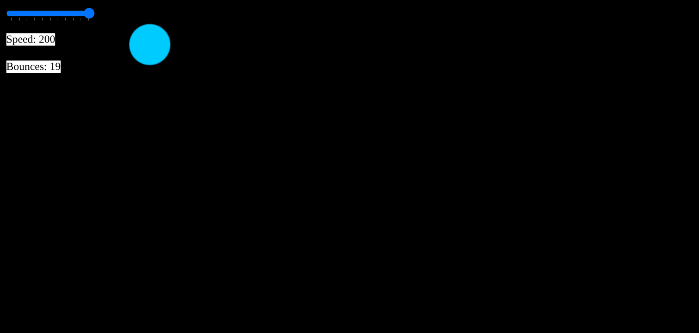

 - A simple interactive game build using HTML canvas and JS.
 # describtion
 - Ball bounces off walls
 - The ball's direction can be controled using arrow keys or WASD
 - color changes with each bounce
 - There is a speed slider to change ball speed
 - Bounce counter to track number of bounces
 # Learned topics
 Learned More about Event Handling, DOM, and JS APIs
 - Learned about simple Game physics such as collision detection
 -  
 
